# Como usar un campo options

<figure><figcaption></figcaption></figure>

 

<figure>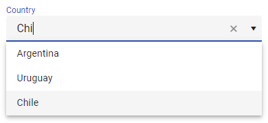<figcaption></figcaption></figure>

## Crear un campo options

Click en 

Colocar el mouse dentro de un Column, saldrá una barra violeta.

<figure>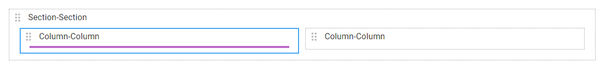<figcaption></figcaption></figure>

Hacer click en la barra violeta, se generará un nuevo campo.

<figure>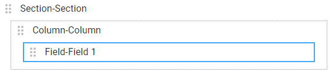<figcaption></figcaption></figure>

Ingresar un nombre al campo y seleccionar el tipo _options_

<figure>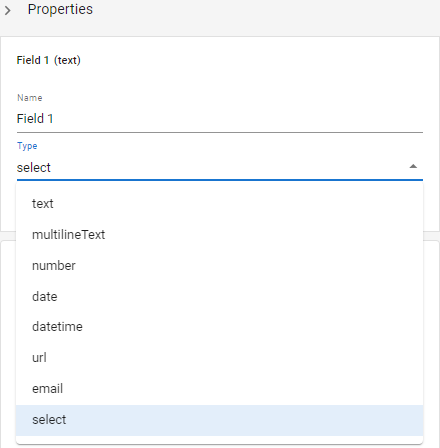<figcaption></figcaption></figure>

Hacer click en _OK_

<figure>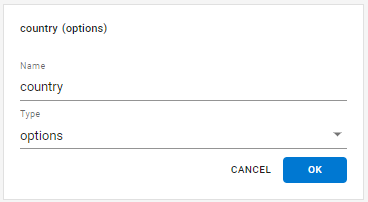<figcaption></figcaption></figure>

Hacer en click en _Add Option_

<figure>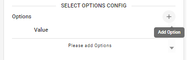<figcaption></figcaption></figure>

Aparece una fila con el valor _Option 1_ por defecto

<figure>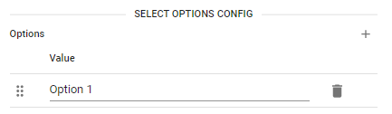<figcaption></figcaption></figure>

Ingresar las opciones requeridas

<figure>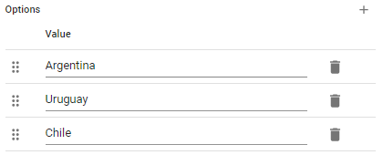<figcaption></figcaption></figure>

## Hacer un campo options condicional a otro campo

En ocasiones necesitamos que la selección de un campo me restrinja las opciones a escoger en otro campo.

Crear un campo _continent._

Habilitar el flag _Conditional Options_

<figure>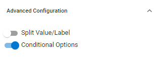<figcaption></figcaption></figure>

Seleccionar _continent_ en _When Field_, agregar _America_ en _New Value_ y hacer click en la flecha

<figure>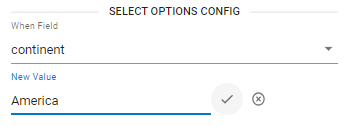<figcaption></figcaption></figure>

Agregar las opciones a mostrar cuando el campo _continent_ tenga el valor _America_

<figure>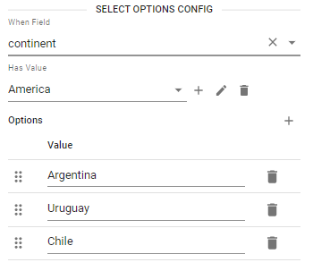<figcaption></figcaption></figure>

Hacer click en _+_ para agregar más opciones condicionales a un valor del campo _continent_.

<figure><figcaption></figcaption></figure>

## Cambiar la etiqueta del campo options

Con la propiedad _Label_ se modifica la etiqueta del campo, que por defecto es el nombre del campo.

<figure>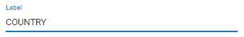<figcaption></figcaption></figure>

<figure><figcaption></figcaption></figure>

## Cambiar el tamaño del campo options

Con la propiedad _Size_ se puede cambiar el tamaño de un campo. Se puede escoger un valor entre 1 y 12.

_**Size 12**_

<figure>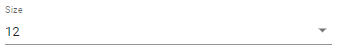<figcaption></figcaption></figure>

<figure><figcaption></figcaption></figure>

_**Size 6**_

<figure>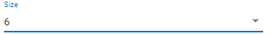<figcaption></figcaption></figure>

<figure><figcaption></figcaption></figure>

## Hacer requerido el campo options

Con la propiedad _Required en True_, se indica que el campo debe ser completado para poder enviar el formulario.

<figure>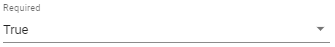<figcaption></figcaption></figure>

<figure>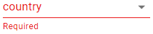<figcaption></figcaption></figure>

## Cambiar como se muestra el campo options

Con la propiedad _Variant_ en _Select_ se muestra como una lista de opciones

<figure>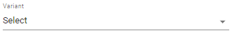<figcaption></figcaption></figure>

<figure>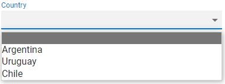<figcaption></figcaption></figure>

Con la propiedad _Variant_ en _Options_ se muestra como un conjuto de botones.

<figure>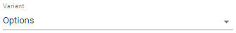<figcaption></figcaption></figure>

<figure><figcaption></figcaption></figure>

Con la propiedad _Variant_ en _ComboBox_ se muestra como una lista de opciones buscables.

<figure>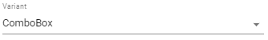<figcaption></figcaption></figure>

<figure><figcaption></figcaption></figure>

### Hacer de solo lectura el campo options

Con la propiedad _Readonly_ activada se deshabilita el ingreso o modificacion de los datos de un campo. El campo aparece grisado y con una linea punteada.

<figure><figcaption></figcaption></figure>

<figure><figcaption></figcaption></figure>
