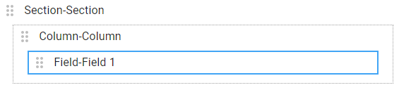
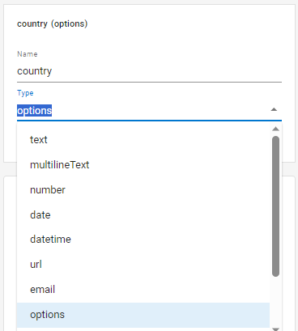
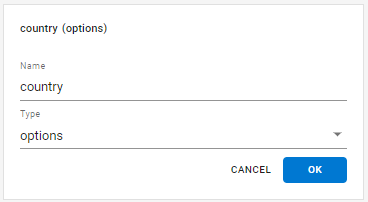

# How to use a options field

<figure><figcaption></figcaption></figure>

## Create a options field

Click en 

Colocar el mouse dentro de un Column, saldrá una barra violeta.

<figure><figcaption></figcaption></figure>

Hacer click en la barra violeta, se generará un nuevo campo.

<figure><figcaption></figcaption></figure>

Ingresar un nombre al campo y seleccionar el tipo _options_

<figure><figcaption></figcaption></figure>

Hacer click en _SAVE_

<figure><figcaption></figcaption></figure>

Hacer en click en _Add Option_

<figure><figcaption></figcaption></figure>

Aparece una fila con el valor _Option 1_ por defecto

<figure><figcaption></figcaption></figure>

Ingresar las opciones requeridas

<figure><figcaption></figcaption></figure>
