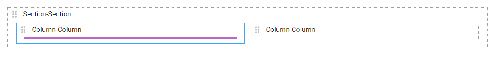

# How to use a options field

<figure><figcaption></figcaption></figure>

## Create a options field

Click en 

Colocar el mouse dentro de un Column, saldrá una barra violeta.

<figure><figcaption></figcaption></figure>

Hacer click en la barra violeta, se generará un nuevo campo.

<figure><figcaption></figcaption></figure>

Seleccionar el tipo _options_

<figure><figcaption></figcaption></figure>

Hacer click en _Save_

<figure><figcaption></figcaption></figure>
