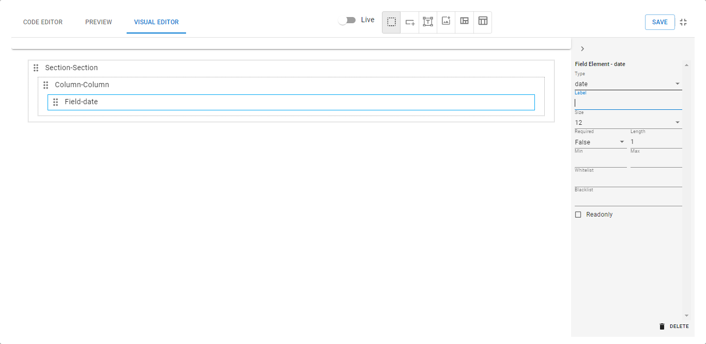
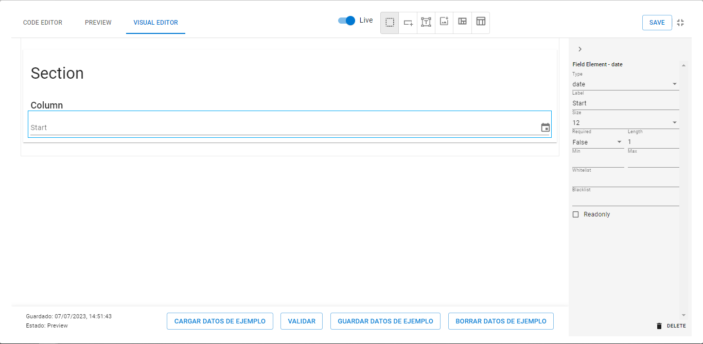
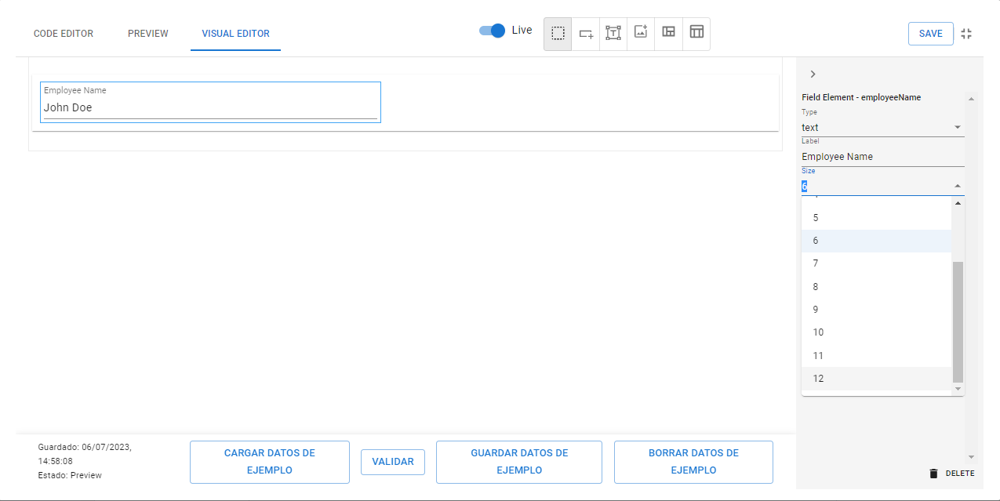
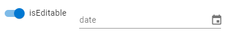
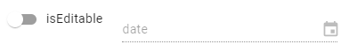
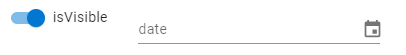
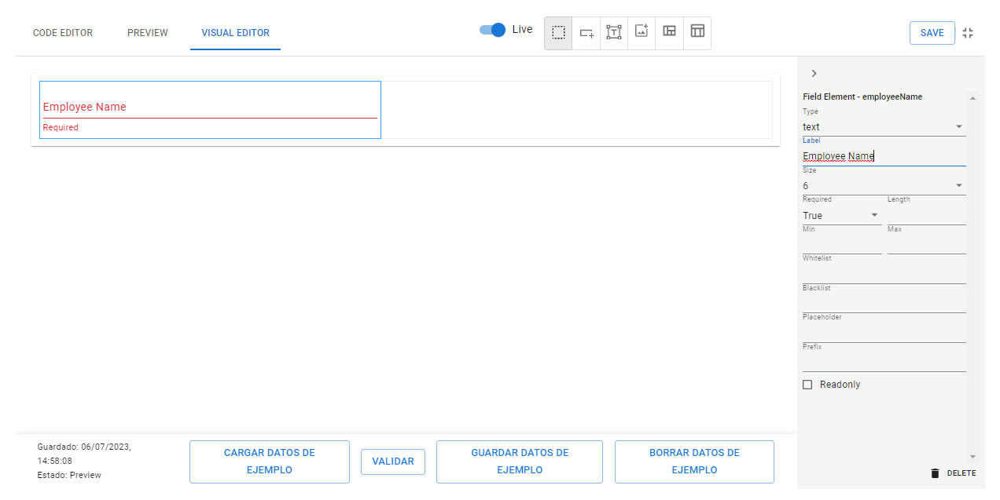

# How to use a date Field

Se debe presionar el botón .png>)

Luego dentro de Column, se visualizará una linea roja.

<figure><figcaption></figcaption></figure>

Al generar el campo, a la derecha aparece un banner con distintas propiedades para parametrizarlo. Se debe seleccionar el tipo _'date'_.

<figure><figcaption></figcaption></figure>

## User Friendly Name

Por defecto, los campos se muestran con el nombre del dato definido, en ocasiones puede no ser amigable al usuario final. En ese caso, existe la propiedad _label_ que permite modificar el nombre por uno más acorde.

<figure><figcaption></figcaption></figure>

## Change size

Por defecto, los campos ocupan todo el espacio horizontal disponible (usando el sistema de grillas de 12 columnas). En caso de querer tener más control de cómo se muestran los elementos, se cuenta con la propiedad _size_ que puede tomar valores entre 1 y 12.

<figure><figcaption><p>Size dropdown</p></figcaption></figure>

## Make it Read-only

Si el campo necesita tener un valor que no pueda ser modificado por quien completa el formulario, se puede configurar con la propiedad _readonly._ Esta recibe un valor booleano o expresión booleana.

El campo aparecerá grisado y con una línea punteada.

#### Boolean Value

<figure><figcaption></figcaption></figure>

<pre class="language-json" data-title="Layout"><code class="lang-json">{
	"elements": [
		{
			"type": "field",
			"name": "date",
<strong>			"readonly": true
</strong>		}
	]
}
</code></pre>

#### Boolean Expression

<figure><figcaption><p>Not readonly</p></figcaption></figure>

<figure><figcaption><p>Readonly</p></figcaption></figure>

<pre class="language-json" data-title="Schema"><code class="lang-json">{
	"isEditable": {
<strong>		"type": "boolean",
</strong>	},
	"date": {
		"type": "date",
	}
}
</code></pre>

<pre class="language-json" data-title="Layout"><code class="lang-json">{
	"elements": [

		{
			"type": "field",
			"name": "isEditable"
		},
		{
			"type": "field",
			"name": "date",
<strong>			"readonly": "not(isEditable)"
</strong>		}
	]
}
</code></pre>

## Make it invisible&#x20;

Se puede hacer que un campo sea o no visible con la propiedad _visibility,_ la cual recibe valores booleanos, o una expresión que devuelva un valor booleano, lo que permite hacer visible en función de otros campos definidos.

#### Boolean Value



```json
{
	"elements": [
		{
			"type": "field",
			"name": "employeeName",
			"visibility": true
		}
	]
}
```


#### Boolean Expression

<figure><figcaption></figcaption></figure>

<figure><figcaption></figcaption></figure>


```json
{
	"isVisible": {
		"type": "boolean",
	},
	"employeeName": {
		"type": "text",
	}
}
```



```json
{
	"elements": [
		{
			"type": "field",
			"name": "employeeName",
			"visibility": "isVisible"
		}
	]
}
```


## Validations

### Required Field

Usando la propiedad "_required_", se indica que el campo debe ser completado para poder enviar el formulario.

<figure><figcaption><p>Required True</p></figcaption></figure>

## Advanced Validations

En el caso de necesitar una validación más especifica o compleja, está el atributo validationExpressions, donde podemos definir una o más validaciones. Cada validación cuenta con los atributos message y expression, en message se guarda el mensaje que saltará cuando se cumpla la condición definida en expression. Para comparar el campo de texto por igualdad contra un texto definido:

Para validar que un campo fecha no es igual que otro campo fecha

"expression": "equal(endDate, beginDate)"

Para validar que un campo fecha es mayor o igual que otro campo fecha

"expression": "not(largerEq(endDate, beginDate))"

Para validar que un campo fecha es menor o igual que otro campo fecha

"expression": "not(smallerEq(beginDate, endDate))"
