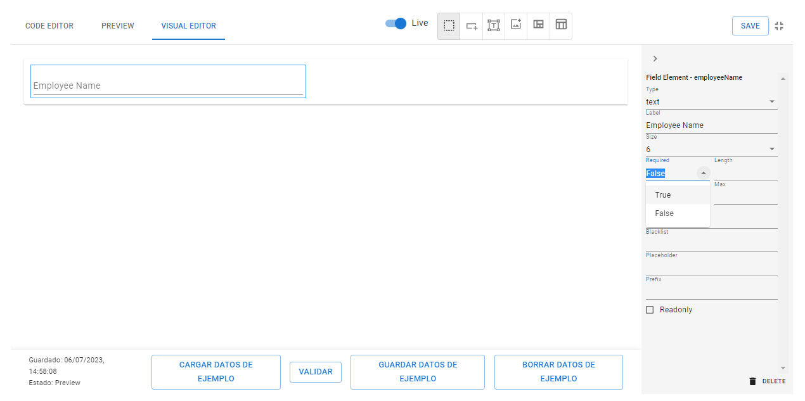
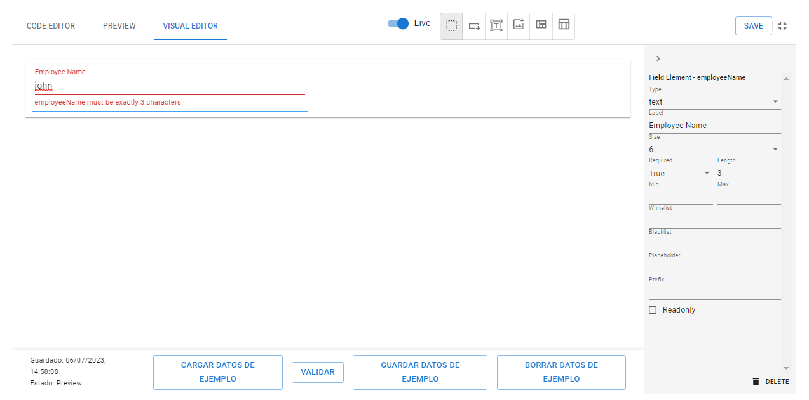
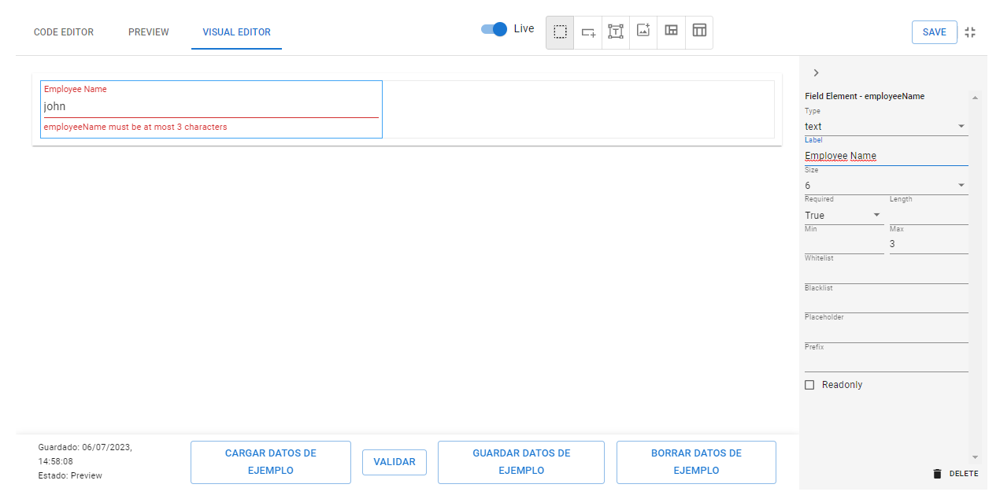
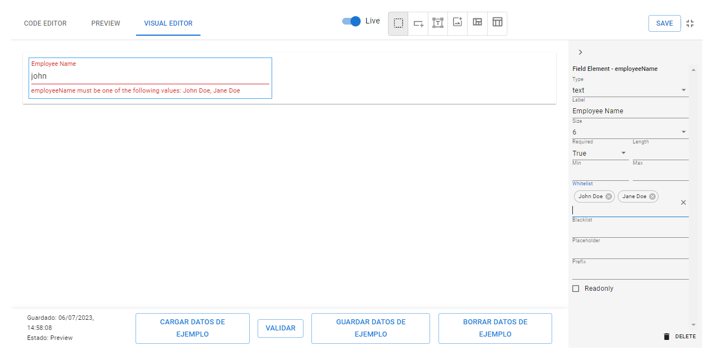
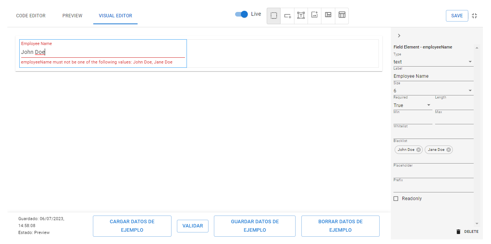

# How to use a text field

<figure><figcaption></figcaption></figure>



Click en 

Click dentro de Column, sale un barra roja.

<figure><figcaption></figcaption></figure>

Se genera el Field, a la derecha aparece un banner con distintas propiedades para parametrizar el Field.

<figure><figcaption></figcaption></figure>



<pre class="language-json" data-title="Schema"><code class="lang-json">{
<strong>	"employeeName": {
</strong><strong>		"type": "text",
</strong>	}
}
</code></pre>

<pre class="language-json" data-title="Layout"><code class="lang-json">{
	"elements": [
		{
<strong>			"type": "field",
</strong><strong>			"name": "employeeName"
</strong>		}
	]
}
</code></pre>



## User Friendly Name

Por defecto, los campos se muestran con el nombre del dato definido, que en ocasiones puede no ser amigable al usuario final, en ese caso, existe la propiedad _label_ que permite modificar el nombre por uno más acorde.



<figure><figcaption><p>Label</p></figcaption></figure>




```json
{
	"elements": [
		{
			"type": "field",
			"name": "employeeName",
			"label": "Employee Name"
		}
	]
}
```




## Change size

Por defecto, los campos ocupan todo el espacio horizontal disponible (Usando el sistema de grillas de 12 columnas). En caso de querer tener más control de cómo se muestran los elementos, contamos con la propiedad _size_ que puede tomar valores entre 1 y 12.



<figure><figcaption><p>Size dropdown</p></figcaption></figure>




```json
{
	"elements": [
		{
			"type": "field",
			"name": "employeeName",
			"size":12
		}
	]
}
```




## Make it Read-only

If a field needs to have a fixed value that cannot be modified by the user, it can be configured using the "_readOnly_" property, which accepts a boolean value or a boolean expression.



#### Boolean Value

<pre class="language-json" data-title="Layout"><code class="lang-json">{
	"elements": [
		{
			"type": "field",
			"name": "employeeName",
<strong>			"readonly": true
</strong>		}
	]
}
</code></pre>

#### Boolean Expression

<pre class="language-json" data-title="Schema"><code class="lang-json">{
	"isEditable": {
<strong>		"type": "boolean",
</strong>	},
	"employeeName": {
		"type": "text",
	}
}
</code></pre>

<pre class="language-json" data-title="Layout"><code class="lang-json">{
	"elements": [
		{
			"type": "field",
			"name": "employeeName",
<strong>			"readonly": "not(isEditable)"
</strong>		}
	]
}
</code></pre>



## Make it invisible&#x20;

Se puede hacer que un campo sea o no visible con la propiedad _visibility,_ recibe valores booleanos, o una expresión que devuelva un valor booleano, lo que permite hacer visible en función de otros campos definidos.



#### Boolean Value


```json
{
	"elements": [
		{
			"type": "field",
			"name": "employeeName",
			"visibility": true
		}
	]
}
```


#### Boolean Expression


```json
{
	"isVisible": {
		"type": "boolean",
	},
	"employeeName": {
		"type": "text",
	}
}
```



```json
{
	"elements": [
		{
			"type": "field",
			"name": "employeeName",
			"visibility": "isVisible"
		}
	]
}
```




## Validations

### Required Field

By using the "_required_" property, it is indicated that this field must be completed in order to submit the form.



<figure><figcaption><p>Required False</p></figcaption></figure>

<figure><figcaption><p>Required True</p></figcaption></figure>



<pre class="language-json" data-title="Schema"><code class="lang-json">{
	"employeeName": {
		"type": "text",
<strong>		"required": true
</strong>	}
}
</code></pre>



### Field with Length Restrictions

To work with these properties, there are different attributes available:

* "_length_": specifies the exact length that the field should have to be considered an acceptable value.
* "_min_": sets the minimum number of characters required for the field to be considered an acceptable value.
* "_max_": sets the maximum number of characters allowed for the field to be considered an acceptable value.



<figure><figcaption><p>Length</p></figcaption></figure>

<figure><figcaption><p>Max</p></figcaption></figure>

<figure><figcaption><p>Min</p></figcaption></figure>



<pre class="language-json" data-title="Schema"><code class="lang-json">{
	"employeeName": {
		"type": "text",
<strong>		"min": 1,
</strong><strong>		"max": 20
</strong>	}
}
</code></pre>



### Field with Set of Accepted Values

If a text field can only have a specific set of valid data, the "_whitelist_" property can be used. It accepts an array of allowed texts. If a value is entered that is not in this list, a validation will be triggered, indicating the valid options.



<figure><figcaption></figcaption></figure>




```json
{
	"employeeName": {
		"type": "text",
			"whitelist": [
				"John Doe",
				"Jane Doe"
			]
		}

}
```




### Field with Set of Rejected Values

Following the same logic as the previous point, the "_blacklist_" property can be used to list a group of data that cannot be entered.



<figure><figcaption></figcaption></figure>




```json
{
	"employeeName": {
		"type": "text",
			"blacklist": [
				"John Doe",
				"Jane Doe"
			]
		}

}
```




### Field with Mask

The field can be configured to accept values only in a specific format of fixed size. This can be done using the "_inputMask_" property.



"_inputMask" property_ defines a pattern mask using the following definitions

* `0` - any digit
* `a` - any letter
* `*` - any char
* `[]` - make input optional
* `{}` - include fixed part in unmasked value
* `` ` `` - prevent symbols shift back


```json
"ArgentinePostalCode":{
	"type": "text",
	"inputMask":"a000[aaa]"
}
```


other way of defining a mask is using "_charOptions" which_ defines placeholders of single character with Regular Expressions and "_mask_" defines the format in function of the placeholder or the the default definitions.


```json
"ArgentinePostalCode":{
	"type": "text",
	"inputMask": {	
            "charOptions": {
                  "A": "[A-Z]"
            },
            "mask": "A000[AAA]"
	}
}
```




### Field with Regular Expressions

Another way to perform validations is by using Regular Expressions or RegEx. This can be done using the "_matches_" attribute, which takes the desired regular expression and the message to be displayed if the expression is not met.




```json
"employeeName": {
      	"type": "text",
	"matches": {
		"message": "must begin with capital letter, can only have up to 20 english letters",
		"regex": "^[A-Z][a-z]{0,19}$"son
	}
}
```




## Advanced Validations

En el caso de necesitar una validación más especifica o compleja, está el atributo validationExpressions, donde podemos definir una o más validaciones. Cada validación cuenta con los atributos message y expression, en message se guarda el mensaje que saltará cuando se cumpla la condición definida en expression. Para comparar el campo de texto por igualdad contra un texto definido:

