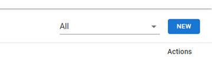
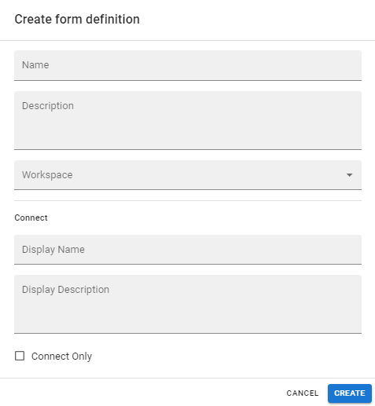

# Creación de un formulario

RPA Connect te permite crear formularios de un modo intuitivo y dinámico. Para comenzar, pulsa el botón _**New**_ en la esquina superior derecha de la pantalla.

<figure><figcaption>
Botón "New"
</figcaption></figure>

Se abrirá una ventana emergente donde podrás completar los datos básicos del formulario:

<figure><figcaption>
Ventana de nuevo formulario
</figcaption></figure>

Por el momento, nos centraremos en los tres primeros campos:

<table><thead><tr><th width="147">Campo</th><th>Modo de uso</th></tr></thead><tbody><tr><td>Name</td><td>Nombre del formulario, con el cual se mostrará en el espacio de trabajo. Es recomendable optar por un nombre con el que luego pueda ser ubicado fácilmente.</td></tr><tr><td>Description</td><td>Una descripción básica del formulario, que brinde más información respecto a su función o utilidad.</td></tr><tr><td>Workspace</td><td>Espacio de trabajo donde se guardará el formulario, que en esta primera creación quedará configurado como “Default”.</td></tr></tbody></table>

Una vez que hayas finalizado, pulsa el botón _**Create**_ para guardar la información ingresada y generar el nuevo formulario.
