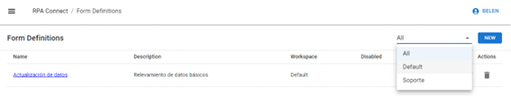
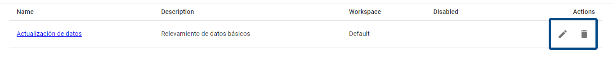
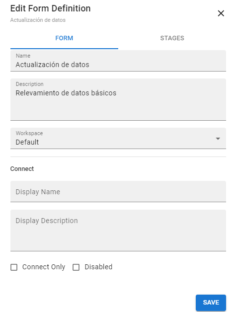
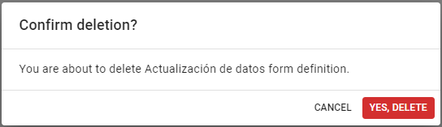
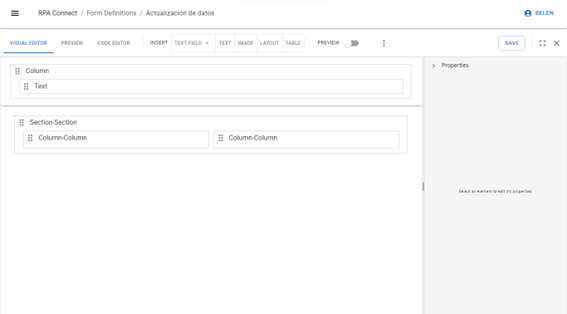
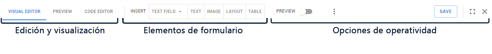

# Entorno de trabajo

## Gestión de formularios

Al crear un nuevo formulario, este aparecerá en tu espacio de trabajo. La opción _**All**_ que está seleccionada en el menú desplegable, indica que se están visualizando todos los espacios de trabajo existentes. A medida que añadas nuevos formularios, desde este menú podrás filtrar por el espacio de trabajo en el que los hayas guardado y así, encontrarlos más fácilmente.

<figure><figcaption>
Espacio de trabajo
</figcaption></figure>

En el apartado _**Acciones**_, encontrarás las opciones de editar y eliminar el formulario, señaladas con los íconos de lápiz y cesto:

<figure><figcaption>
Acciones de editar y eliminar
</figcaption></figure>

La primera opción abrirá la ventana del formulario en el lateral derecho, permitiéndote editar sus características, como nombre y descripción. Puedes modificar los datos que necesites y luego pulsar _**Save**_ para guardar los cambios.

<figure><figcaption>
Edición de un formulario creado
</figcaption></figure>

Con la opción de eliminar, podrás descartar un formulario que no necesites, para lo cual la plataforma solicitará una confirmación. Pulsa _**Cancel**_ para cancelar la acción y volver al espacio de trabajo o _**Yes, delete**_ para borrarlo definitivamente. Ten en cuenta que, una vez que eliminas un formulario, no puede recuperarse.

<figure><figcaption>
Confirmación de eliminación de un formulario
</figcaption></figure>

## Editor de formularios

Haciendo clic sobre el nombre del formulario, que se destacará como un enlace en color azul, accederás al editor para comenzar a organizar sus componentes. Por defecto, se mostrará una base preconfigurada que podrás utilizar o bien, modificar o borrar según lo necesites.

<figure><figcaption>
Esquema de formulario preconfigurado
</figcaption></figure>

En la barra de menú, encontrarás:

* Las herramientas de edición y visualización del formulario, que te permitirán alternar entre el editor visual, el editor de código y la previsualización.
* El menú de elementos de formulario, donde podrás seleccionar los campos que desees insertar para mostrar o registrar datos.
* Otras opciones de operatividad, tales como atajos de teclado, guardar y cerrar.

<figure><figcaption>
Barra de menú del editor
</figcaption></figure>

Más adelante profundizaremos en cada una de estas herramientas, pero ahora vamos a enfocarnos en los elementos que componen el formulario y su distribución. Comenzaremos realizando un diseño básico a partir de la plantilla predeterminada, mientras te familiarizas con el funcionamiento de RPA Connect.
