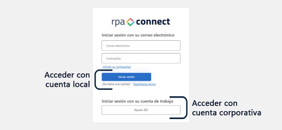
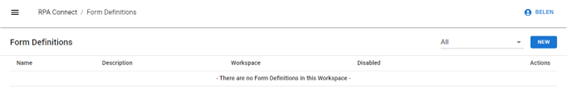

---
layout:
  title:
    visible: true
  description:
    visible: true
  tableOfContents:
    visible: true
  outline:
    visible: true
  pagination:
    visible: true
---

# Inicio de sesión en RPA Connect

Para comenzar a crear tus propios formularios, debes iniciar sesión en la web de RPA Connect, ingresando a [https://app.rpaconnect.io/build/form-definitions](https://app.rpaconnect.io/build/form-definitions). Puedes elegir entre dos opciones para acceder, dependiendo de la cuenta con la que te hayas registrado:

<figure><figcaption>
Opciones de inicio de sesión en RPA Connect
</figcaption></figure>

Al ingresar por primera vez, encontrarás el espacio de trabajo por defecto, donde aún no hay documentos para mostrar. Es en esta pantalla donde más adelante podrás buscar, editar y eliminar todos los formularios que crees a través de la plataforma.

<figure><figcaption>
Espacio de trabajo
</figcaption></figure>

A continuación, conocerás cómo crear tu primer formulario en RPA Connect y aprenderás los aspectos básicos de su diseño a través del editor visual integrado en la herramienta.
